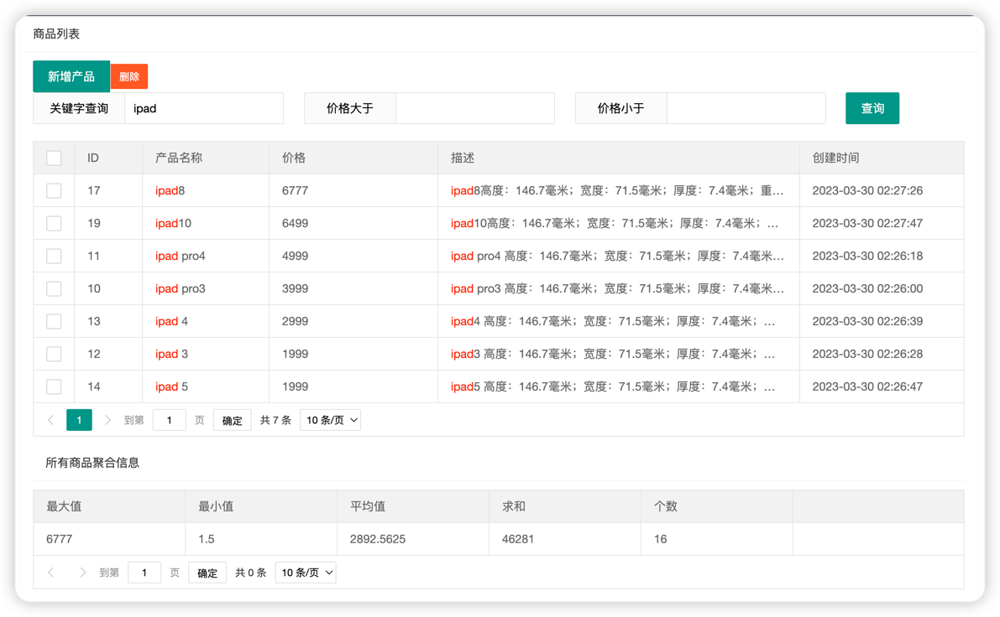

# Spring Boot + Elasticsearch 整合Demo

### 框架技术
* SpringBoot 2.3.7.RELEASE
* Elasticsearch 7.6.2

### 项目配置
* Elasticsearch 配置
```properties
#非必须配置，默认值为localhost
es.host=localhost
#非必须配置，默认值9200
es.port=9200
```
* 数据库配置
在application.properties


### 启动项目
1. 首先启动Elasticsearch服务

2. 访问http://localhost:8080 进入首页进行产品信息的添加和搜索



